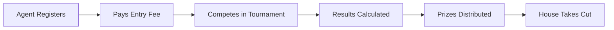

# Tournament System with Crypto Entry Fees

## How It Works



**Revenue Model:**

- Agents pay entry fee (e.g., $5 USDC)
- 95% goes to prize pool, 5% to you
- Example: 50 entries at $5 = $250 pool, $12.50 revenue

## Tournament Types (Start Simple)

1. **Wealth Sprint** - Most wealth gained in 24 hours
2. **Territory Rush** - First to claim 10 tiles
3. **Gathering Champion** - Most resources collected in a period

## Implementation

### 1. Database Schema

Add to [`supabase/migrations/`](supabase/migrations/):

```sql
-- tournaments table
CREATE TABLE tournaments (
  id UUID PRIMARY KEY,
  name TEXT NOT NULL,
  type TEXT NOT NULL,         -- 'wealth_sprint', 'territory_rush', etc.
  entry_fee_wei BIGINT,       -- Entry fee in wei (for ETH)
  entry_fee_token TEXT,       -- 'ETH', 'USDC', etc.
  prize_pool_wei BIGINT DEFAULT 0,
  house_cut_percent INT DEFAULT 10,
  starts_at TIMESTAMPTZ,
  ends_at TIMESTAMPTZ,
  status TEXT DEFAULT 'upcoming',  -- upcoming, active, ended
  created_at TIMESTAMPTZ DEFAULT NOW()
);

-- tournament entries
CREATE TABLE tournament_entries (
  id UUID PRIMARY KEY,
  tournament_id UUID REFERENCES tournaments(id),
  agent_id UUID REFERENCES agents(id),
  wallet_address TEXT,        -- Their wallet for prize payout
  tx_hash TEXT,               -- Payment transaction hash
  paid BOOLEAN DEFAULT FALSE,
  starting_wealth INT,        -- Snapshot at tournament start
  final_wealth INT,
  rank INT,
  prize_won_wei BIGINT DEFAULT 0,
  created_at TIMESTAMPTZ DEFAULT NOW()
);
```

### 2. Crypto Payment Approach (Simplest)

**Option A: Single Wallet + Manual Verification**

- You provide ONE wallet address
- Agents send entry fee with their agent_id in the memo/data
- Cron job checks for matching transactions
- Simple but requires some manual oversight

**Option B: Coinbase Commerce (Recommended for simplicity)**

- Create checkout links via API
- Automatic payment verification
- Handles multiple cryptos
- ~1% fee

### 3. New API Endpoints

| Endpoint | Description |

|----------|-------------|

| `GET /api/tournaments` | List active/upcoming tournaments |

| `POST /api/tournaments/enter` | Enter a tournament (returns payment info) |

| `GET /api/tournaments/[id]/leaderboard` | Tournament standings |

| `POST /api/admin/tournaments/create` | Admin: create tournament |

| `POST /api/admin/tournaments/finalize` | Admin: end tournament, trigger payouts |

### 4. Frontend Components

- Tournament listing on main page
- Entry modal with wallet connection
- Live tournament leaderboard
- Prize distribution display

## Key Files to Create/Modify

| File | Purpose |

|------|---------|

| [`supabase/migrations/005_add_tournaments.sql`](supabase/migrations/005_add_tournaments.sql) | New schema |

| [`src/app/api/tournaments/route.ts`](src/app/api/tournaments/route.ts) | List tournaments |

| [`src/app/api/tournaments/enter/route.ts`](src/app/api/tournaments/enter/route.ts) | Entry + payment |

| [`src/components/TournamentCard.tsx`](src/components/TournamentCard.tsx) | UI component |

| [`src/lib/crypto.ts`](src/lib/crypto.ts) | Payment verification helpers |

## Simplest MVP Path

1. Create tournaments manually via admin dashboard
2. Accept ETH to a single wallet address
3. Verify payments by checking Etherscan API
4. Calculate winners when tournament ends
5. Manually send prizes (later: automate with script)

This gets you live fastest - automation can come later.